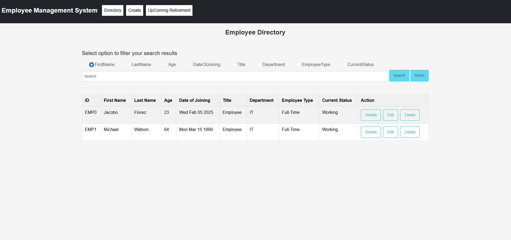
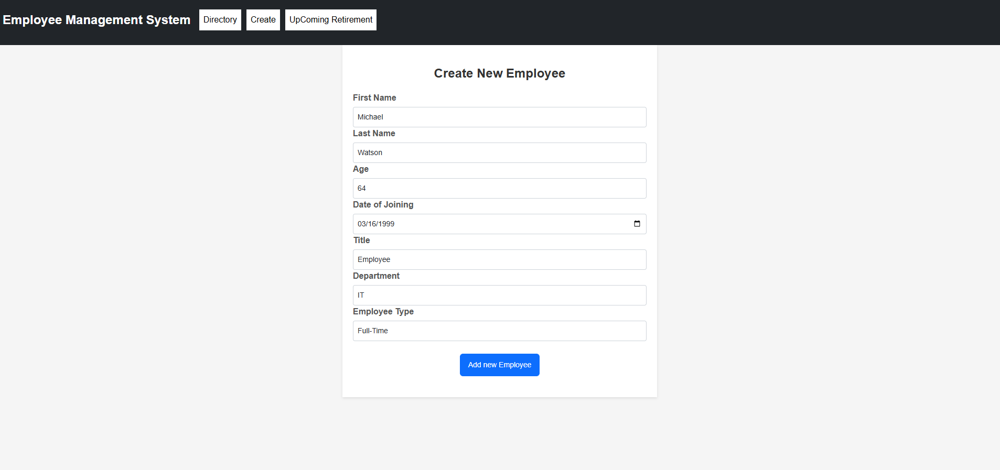
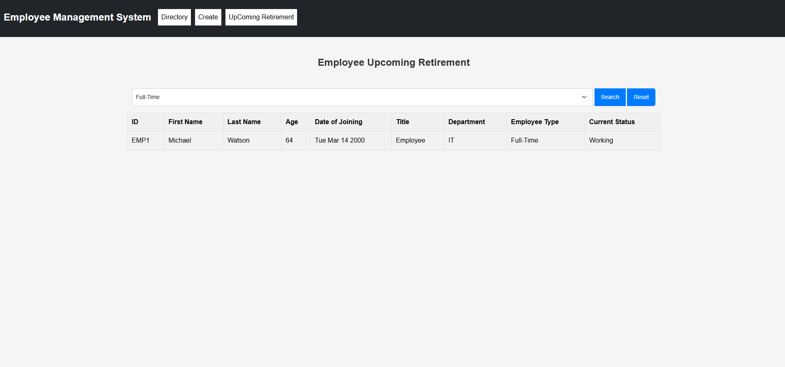

# 👨‍🏫 Employee Management System

## 📌 Overview

The **Employee Management System** is a full-stack web application designed to manage employee records efficiently. The system consists of:

- **Backend**: Built with **Node.js, Express.js, MongoDB, and GraphQL**, handling API requests and database operations.
- **Frontend**: Developed with **React.js**, providing an intuitive interface to interact with the system.

This project was developed as part of a **college final group project** and showcases full-stack development skills, including **API integration, database management, and UI design**.

---

## 🌍 Live Demo

🚀 **Try it out here**: [Employee Management System Live Demo](https://employee-management-smoky-tau.vercel.app/)

---

## 🚀 Features

- **GraphQL API** – Efficient data retrieval and management.
- **CRUD Operations** – Add, update, delete, and retrieve employee records.
- **MongoDB Integration** – NoSQL database for structured storage.
- **React-Based UI** – Interactive and user-friendly interface.
- **Employee Directory** – Search, filter, and manage employees.
- **Bootstrap Styling** – Clean and responsive UI.
- **Routing & Navigation** – Implemented using React Router.

---

## 🔧 Technologies Used

### Backend
- **Node.js**, **Express.js**
- **MongoDB** (NoSQL database)
- **GraphQL** (Apollo Server)
- **dotenv** for environment variables

### Frontend
- **React.js**, JSX
- **React Router** for navigation
- **Bootstrap** for styling
- **Axios** for API requests

---

## 📌 Project Purpose

This project demonstrates:

- **Full-Stack Development:** Seamless integration of backend and frontend technologies.
- **GraphQL API Efficiency:** Query optimization for better performance.
- **Database Management:** Secure and structured data handling with MongoDB.
- **Component-Based UI:** Modular React components for scalability.
- **User-Friendly Interface:** Responsive and interactive design with Bootstrap.
- **Scalability & Optimization:** Well-structured code and optimized queries for high performance.

---

## 📂 Project Structure

```
employee-management
│── employee-management-server  # Backend (Node.js, Express, MongoDB, GraphQL)
│── employee-management-system  # Frontend (React)
│── README.md                   # Main project documentation
│── .gitignore
```

---

## 🏃‍♂️ How to Run

### 🔹 Clone the Repository
```sh
git clone https://github.com/jjacoboflorez95/employee-management.git
cd employee-management
```

### 🔹 Backend Setup
```sh
cd employee-management-server
npm install
cp .env.example .env  # Configure environment variables
npm start
```

### 🔹 Frontend Setup
```sh
cd ../employee-management-system
npm install
npm start
```

Access the frontend at:
```plaintext
http://localhost:3000
```

GraphQL API Playground:
```plaintext
http://localhost:5003/graphql
```

📌 **Ensure the backend is running before launching the frontend.**

---

## 🖼 Screenshots
| Home | Create | Upcoming Retirement |
|-----------|-----------|-----------|
|  |  |  |

---

## 📌 Contact
👤 **Juan Jacobo Florez Monroy**  
🌐 **Portfolio**: [jjacobo95.com](https://jjacobo95.com)  
🐙 **GitHub**: [github.com/jjacoboflorez95](https://github.com/jjacoboflorez95)